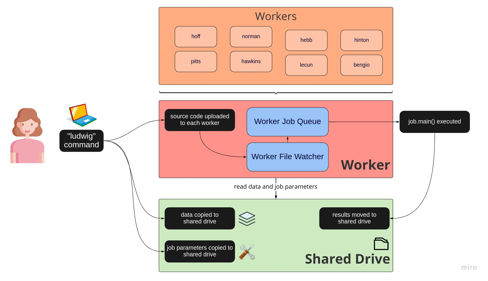

<div align="center">
  
</div>


## About

The UIUC Learning & language Lab provides compute resources for lab members and collaborators wishing to train large neural network models. 
The resource consists of a file server and 8 Ubuntu 16.04 machines with GPU acceleration for deep learning tasks.

## Worker Specs

| hostname  |GPU                    |CPU                          |Product Name        |Storage             |
|-----------|-----------------------|-----------------------------|--------------------|--------------------|
| hoff      |1 Geforce GTX 1080     |Intel i7-7700  CPU @ 3.60GHz |Alienware Aurora R6 |256GB SSD + 1TB HDD |
| norman    |1 Geforce GTX 1080     |Intel i7-7700  CPU @ 3.60GHz |Alienware Aurora R6 |256GB SSD + 1TB HDD |
| hebb      |1 Geforce GTX 1080     |Intel i7-7700  CPU @ 3.60GHz |Alienware Aurora R6 |256GB SSD + 1TB HDD |
| hinton    |1 Geforce GTX 1080     |Intel i7-7700  CPU @ 3.60GHz |Alienware Aurora R6 |256GB SSD + 1TB HDD |
| pitts     |1 Geforce GTX 1080     |Intel i7-7700  CPU @ 3.60GHz |Alienware Aurora R6 |256GB SSD + 1TB HDD |
| hawkins   |1 Geforce GTX 1080 Ti  |Intel i7-8700K CPU @ 3.70GHz |Alienware Aurora R7 |256GB SSD + 1TB HDD |
| lecun     |1 Geforce GTX 1080 Ti  |Intel i7-8700K CPU @ 3.70GHz |Alienware Aurora R7 |256GB SSD + 1TB HDD |
| bengio    |1 Geforce GTX 1080 Ti  |Intel i7-8700K CPU @ 3.70GHz |Alienware Aurora R7 |256GB SSD + 1TB HDD |

Installations:
* Ubuntu 16.04.7 LTS
* python3.7.9
* nvidia-430
* pytorch==1.6.0+cu101
* transformers==4.12.5
* tokenizers==0.10.1
* datasets==1.16.1
* numpy==1.17.5
* gensim==4.1.2


## Overview

`ludwig` implements both server-side and client-side logic. 
That means that `ludwig` is both used:
 1. by the user to submit jobs to workers, and
 2. by each worker to watch for job submissions, manage the job queue, and run jobs.
 
Client-side, a user invokes the `ludwig` command to submit jobs. 
On each worker, file-watchers that are part of the `ludwig` package watch for uploaded job instructions, and save instructions to a job queue.

For an illustration, consider the flowchart below.
Notice that each worker has its own (independent) file-watcher and job queue.
 
<div align="center">
  
</div>

## Documentation

Information about how the system was setup and works behind-the-scenes can be found at [https://docs.philhuebner.com/ludwig](https://docs.philhuebner.com/ludwig).

## Getting Started

### Linux or MacOS
Windows is currently not supported due to incompatibility with file names used by Ludwig.

### Python
Tasks submitted to Ludwig must be programmed in Python 3 (the Python3.7 interpreter is used on each worker).

### Access to the shared drive
See the administrator to get access to the lab's shared drive. 
Mount the drive at ```/media/ludwig_data```. On Linux based systems, type:

```bash
mount /media/ludwig_data
```

The shared drive is hosted by the lab's file server using the ```samba``` protocol. 
Like the client (i.e. user), each worker has access to the shared drive. 
The shared drive is the place where all job related data and results are stored, and accessed. 

### Start a new Project using Ludwig-Template

```ludwig``` requires all Python code be located in a folder inside the root directory of your project. 
Additionally, inside this folder, create two Python files:
* ```params.py```: contains information about which parameters to use for each job
* ```config.py```: contains basic information like the name of the user's project
 
The easiest way to recreate the required organization is to login to Github,
 navigate to [Ludwig-Template](https://github.com/UIUCLearningLanguageLab/Ludwig-Template), and then click "Use this template" (green button).
 
Rename the folder `Ludwig-Template` to something like `MyProject`, and rename the source code folder `src` to `myproject`. 
It is recommended to install a virtual Python interpreter in your project. 
Use Python 3.7 if you can, or, at the very least, write code that is compatible with Python 3.7.


### Installation

Next, inside your Python virtual environment, install `ludwig` from Github:

```bash
pip3 install git+https://github.com/phueb/Ludwig.git
```

## Submitting a Job

Once you have installed `ludwig` and set up your project appropriately, use the command-line tool to submit your job.
To submit jobs, go to your project root folder, and invoke the command-line tool that is part of `ludwig`:

```bash
ludwig
``` 

If it is your first time submitting jobs, consider moving any data related to your job to the shared drive. 
For instance, to move data files in the folder `data` to the shared drive, where it can be accessed by workers, do:

```bash
ludwig -e data/
``` 

To run each job multiple times, use the `-r` flag. For instance, to run each job 6 times, do:

```bash
ludwig -r 6
``` 

See the section Troubleshooting if errors are encountered. 
Consider consulting information about available command line arguments:

```bash
ludwig -h
``` 

### Check status of workers

To get fast feedback about potential problems with your submitted jobs, try:

```bash
ludwig-status
```

To check the status of a specific Ludwig worker (e.g. hawkins):

```bash
ludwig-status -w hawkins
```


### Viewing output of jobs

By default, the stdout of a submitted job will be redirected to a file located on the shared drive.
After uploading your code, verify that your task is being processed by reading the log file.
The log files are available at `/media/ludwig_data/stdout`.
To quickly access a log file, execute:

```bash
tail -f /media/ludwig_data/stdout/hawkins.out
```

If you don't recognize the output in the file, it is likely that the worker is currently processing another user's job.

### Re-submitting

Any time new jobs are submitted, any previously submitted jobs associated with the same project and still running, 
will be killed.

## Troubleshooting 

### Error hostkey not found

You may get an error message saying that hostkeys cannot be found.
To add the worker's hostkeys to your machine, use `sftp` to connect to each worker, 
to trigger a prompt asking to copy the worker's hostkey. 
For example,

```bash
sftp ludwig@hawkins
```

When asked to save the hostkey, enter `yes` and hit `Enter`.

Alternatively, skip hostkey checking with the `-s` flag:

```bash
ludwig -s
```

### Non-standard mount location

Across different operating systems, the default mount location is different.
That means that the path to the shared drive will be different.
To upload data or third-party source code to the shared drive, ```ludwig``` must be explicitly told where to find the shared drive:

For example, if `ludwig_data` is mounted at `/Volumes/ludwig_data`:

```
ludwig -mnt /Volumes/ludwig_data
```
The ```-mnt``` flag is used to specify where the shared drive is mounted on the user's machine.

## Advanced Usage

### Reading from File Server during remote job execution

A user might want to load a dataset from the shared drive.
To do so, the path to the shared drive from the Ludwig worker must be known.
The path is auto-magically added by `Ludwig` and can be accessed via `param2val['project_path']`.
For example, loading a corpus from the shared drive might look like the following:

```python
from pathlib import Path

def main(param2val):
    
    project_path = Path(param2val['project_path'])
    corpus_path = project_path / 'data' / f'{param2val["corpus_name"]}.txt'
    corpus = load_corpus(corpus_path)
```

### Saving Job Results
Job results, such as learning curves, or other 1-dimensional performance measures related to neural networks for example,
 should be returned by job.main() as a list of pandas Series objects.
These will be automatically saved to the shared drive after a job has completed.

Alternatively, if the data is too big to be held in memory, it is recommended to write the data to disk,
and manually move it to the shared drive at the end of main.job(), as illustrated here: 

```python
from pathlib import Path

def main(param2val):

    # some neural network training code
    # ....
    
    # get save_path - all files in this location will be moved to file-server
    save_path = Path(param2val['save_path'])
    
    # make sure to create the directory if running job on local machine (Ludwig creates this directory automatically on worker, however)
    if not save_path.exists():
        save_path.mkdir(parents=True)
    
    # save a file
    with (save_path / 'test.txt').open('r') as f:
        f.write('test') 
    
```

## Development & Debugging

Sometimes you may wish to use your local machine instead of a Ludwig worker to execute your job.
To do so, navigate to the root directory of your project and use the `--local` flag as shown below.

```bash
ludwig --local
```

Results will still be saved to the server. 
To run jobs without access to the server, use the `--isolated` flag, as shown below. 
This is useful for developing and debugging your code without having to submit it to a Ludwig worker for execution.

```bash
ludwig --isolated
```
